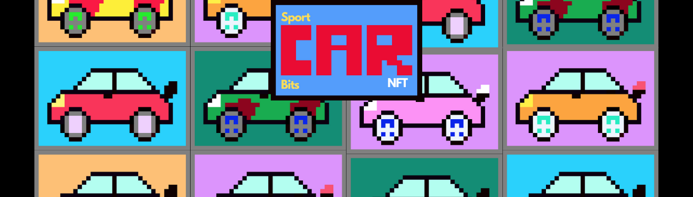
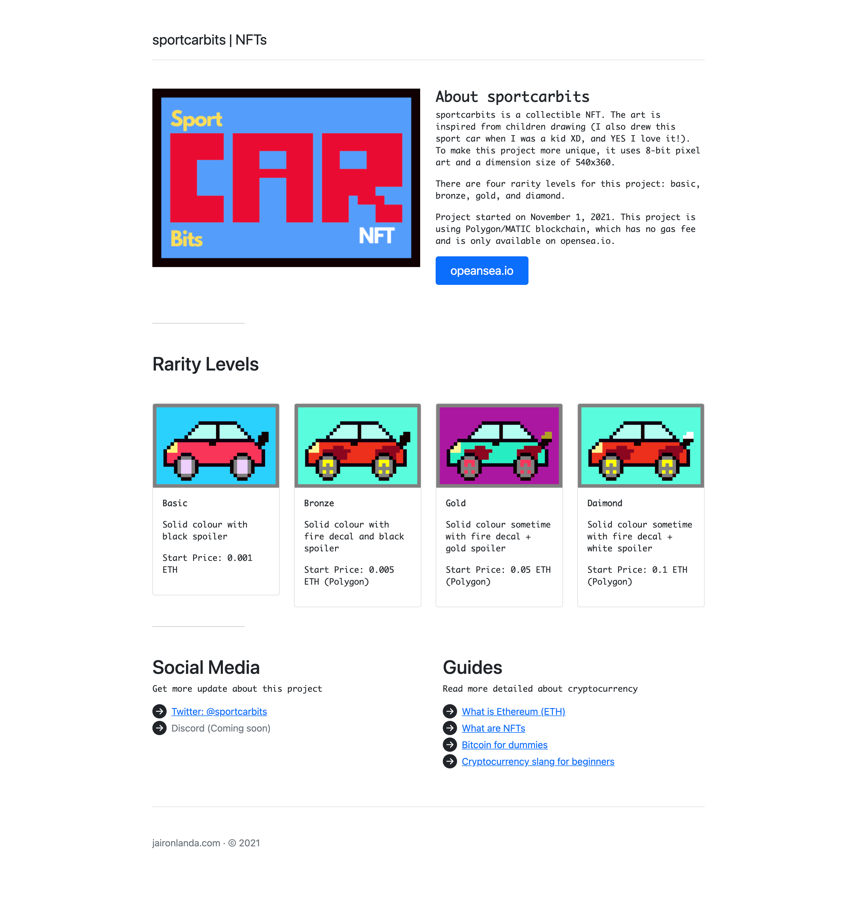

# sportcarbits | NFT collectible

## What is sportcarbits NFT?
sportcarbits is a collectible NFT. The art is inspired from children drawing (I also drew this sport car when I was a kid XD, and YES I love it!). To make this project more unique, it uses 8-bit pixel art and a dimension size of 540x360.

There are four rarity levels for this project: basic, bronze, gold, and diamond.

Project started on November 1, 2021. This project is using Polygon/MATIC blockchain, which has no gas fee and is only available on opensea.io

- Website: https://sportcarbits.com/
- Twitter: https://twitter.com/sportcarbits
- opeansea: https://opensea.io/sportcarbits

### Web preview
